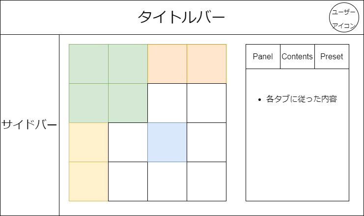
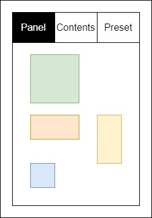
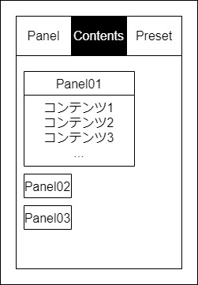
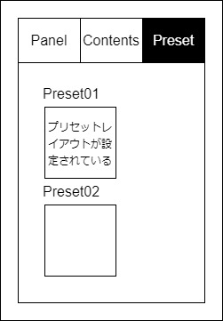

<!-- # テンプレ(画面) -->

## 画面名

-   カスタマイズ画面

---

## UI

## 

## 機能概要

-   メイン画面で表示するパネルのレイアウトを変更する
-   パネルに設定するコンテンツを変更する

---

## 機能詳細

-   **共通**
    -   タブクリックによって操作切り替え
    -   現在アクティブなタブは黒くなる
-   **Panel タブ**
    -   パネルのレイアウトを設定する
    -   各サイズのパネルを配置可能な任意の場所に設定できる
    -   ドラッグアンドドロップで操作
    -   
-   **Contents タブ**
    -   パネルのコンテンツを設定する
    -   パネルごとのドロップダウンリストから，そのパネルに設定したいコンテンツを選択する
    -   
-   **Preset タブ**
    -   パネルプリセットを選択する
    -   あらかじめ用意されたレイアウトプリセットを選択する
    -   プリセット選択後でも Panel タブや Contents タブでレイアウトの変更が可能
    -   

---

## 必要なデータ

-   ユーザー ID 
    取得元：Cookie(セッション ID で管理)
-   ユーザーパネル情報 
    取得元：DB(ユーザーパネル情報テーブル)
-   全パネル情報 
    取得元：DB(パネルマスタテーブル)

---

## ユーザー操作

-   各タブのクリック
-   Panel タブ 
    パネルのドラッグアンドドロップ
-   Contents タブ 
    ドロップダウンリストのクリック
-   Preset タブ 
    プリセットレイアウトのクリック
