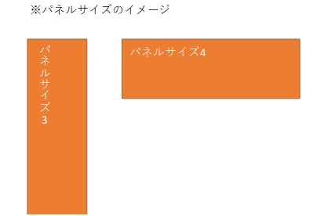
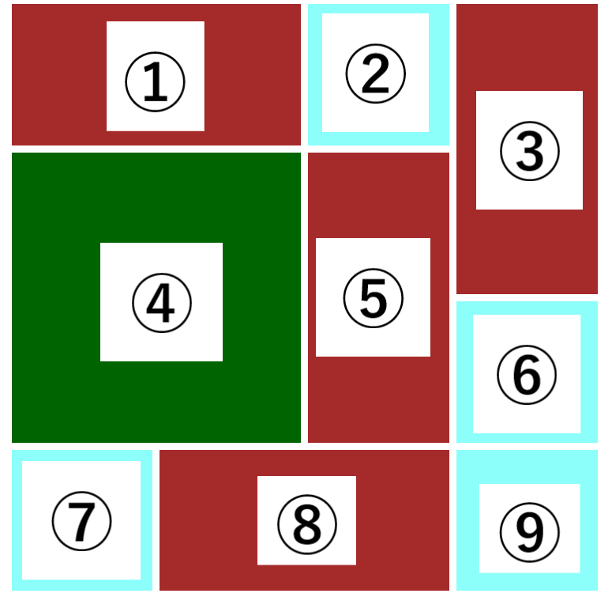

## テーブル情報

-   論理テーブル名：ユーザーマスタ
-   物理テーブル名：m_user
-   更新日　　　：2022/11/04

## カラム情報

| No. | 論理名           | 物理名        | データ型 | サイズ | 主キー | NULL 許容 | デフォルト値 | 備考                                         |
| --- | ---------------- | ------------- | -------- | ------ | ------ | --------- | ------------ | -------------------------------------------- |
| 1   | ユーザー ID      | user_id       | VARCHAR  | 20     | ○      | ×         | なし         | ユーザーログイン時に使用する。               |
| 2   | ユーザー名       | user_name     | VARCHAR  | 40     | ×      | ×         | なし         | ユーザー登録時はユーザー ID と同じ値にする。 |
| 3   | パスワード       | password_hash | CHAR     | 60     | ×      | ×         | なし         | -                                            |
| 4   | ユーザーアイコン | user_icon     | TEXT     | -      | ×      | ○         | なし         | ユーザーアイコンの絶対パス。                 |
| 5   | 登録日時         | insert_time   | DATETIME | -      | ×      | ○         | なし         | -                                            |
| 6   | 更新日時         | update_time   | DATETIME | -      | ×      | ○         | なし         | ユーザー登録時は登録日時と同じ値にする。     |

---

## テーブル情報

-   論理テーブル名：ユーザーパネル情報
-   物理テーブル名：t_user_panel_info
-   更新日　　　：2022/11/04

## カラム情報

| No. | 論理名       | 物理名     | データ型 | サイズ        | 主キー | NULL 許容 | デフォルト値 | 備考                                                                                        |
| --- | ------------ | ---------- | -------- | ------------- | ------ | --------- | ------------ | ------------------------------------------------------------------------------------------- |
| 1   | ユーザー ID  | user_id    | VARCHAR  | 20            | ○      | ×         | なし         | -                                                                                           |
| 2   | パネル名     | panel_name | VARCHAR  | 100           | ×      | ○         | なし         | パネルが、どのコンテンツであるかを表す。パネルクラスで定義するパネル名を使用する。          |
| 3   | アンカー番号 | anchor_num | SMALLINT | 0 ～ 16777215 | ○      | ×         | なし         | 符号なし。パネルの位置を表す。現状の値の範囲は 0~15(4\*4 マス)。                            |
| 4   | パネルサイズ | panel_size | TINYINT  | 0 ～ 255      | ×      | ○         | 5            | 符号なし。5：小(1/16 サイズ)、4：中(1/8 サイズ(※))、3：中(1/8 サイズ(※))、2：大(1/4 サイズ) |

---

## テーブル情報

-   論理テーブル名：パネルマスタ
-   物理テーブル名：m_panel
-   更新日　　　：2022/11/04

## カラム情報

| No. | 論理名           | 物理名        | データ型 | サイズ | 主キー | NULL 許容 | デフォルト値 | 備考                             |
| --- | ---------------- | ------------- | -------- | ------ | ------ | --------- | ------------ | -------------------------------- |
| 1   | パネル名         | panel_name    | VARCHAR  | 100    | ○      | ×         | なし         | -                                |
| 2   | コンテンツリンク | content_link  | TEXT     | -      | ×      | ×         | なし         | HTML、PHP ファイルへの絶対パス。 |
| 3   | コンテンツ画像   | content_image | TEXT     | -      | ×      | ×         | なし         | 画像の絶対パス。                 |

## コンテンツパネルとテーブルの対応

コンテンツパネルは、4×4 のマスで構成されます。
計 16 個のマスには、次の画像のように 0 から 15 までの番号が割り振られます。
この番号は、ユーザパネル情報テーブルのアンカー番号に格納され、パネルの開始位置を表すために用いられます。

コンテンツパネルには、形の異なる 4 種類のパネルを自由に配置できます。
4 種類のパネルには、2 から 5 までの番号が割り振られます。
この番号は、ユーザパネル情報テーブルのパネルサイズに格納され、パネルの大きさを表すために用いられます。

### 具体例

| No. | パネル名 | アンカー番号 | パネルサイズ | コンテンツリンク   | コンテンツ画像   |
| --- | -------- | ------------ | ------------ | ------------------ | ---------------- |
| 1   | アプリ A | 0            | 4            | "/images/appA.jpg" | "/app/appA.html" |
| 2   | アプリ E | 2            | 5            | "/images/appE.jpg" | "/app/appE.html" |
| 3   | アプリ D | 3            | 3            | "/images/appD.jpg" | "/app/appD.html" |
| 4   | アプリ F | 4            | 2            | "/images/appF.jpg" | "/app/appF.html" |
| 5   | アプリ D | 6            | 3            | "/images/appD.jpg" | "/app/appD.html" |
| 6   | アプリ E | 11           | 5            | "/images/appE.jpg" | "/app/appE.html" |
| 7   | アプリ E | 12           | 5            | "/images/appE.jpg" | "/app/appE.html" |
| 8   | アプリ A | 13           | 4            | "/images/appA.jpg" | "/app/appA.html" |
| 9   | アプリ E | 15           | 5            | "/images/appE.jpg" | "/app/appE.html" |

このときのコンテンツパネルは次の画像のようになります。

