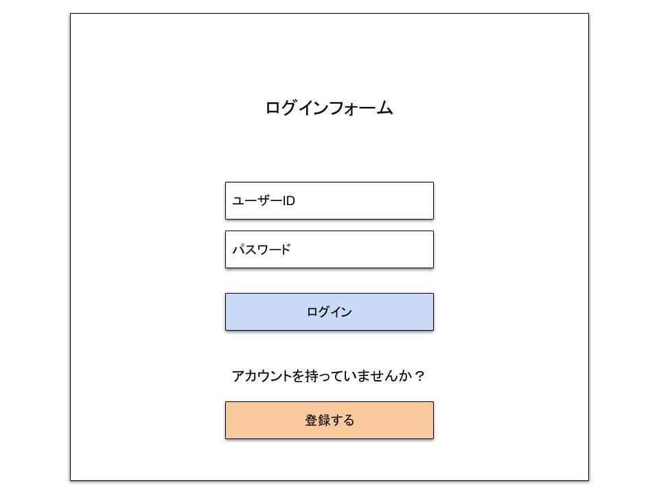
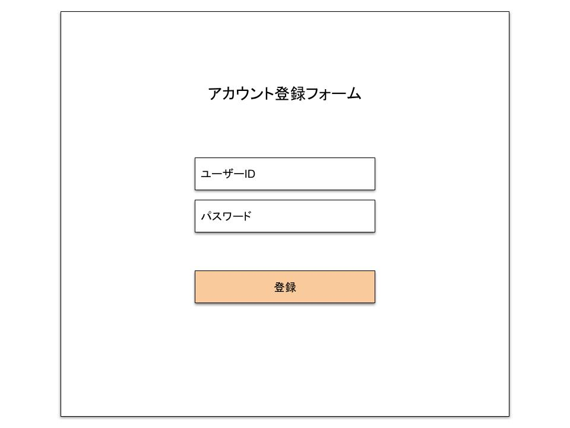

## 画面名

-   サインインアップ画面

---

## UI

-   サインイン画面
    
-   サインアップ画面
    

---

## 機能概要

-   入力されたユーザー ID とパスワードを照合してログインする
-   入力されたユーザー ID とパスワードからユーザーアカウントを作成する

---

## 機能詳細

-   **ユーザー ID**
    -   ユーザー ID を入力するテキストボックス
    -   2 バイト文字が含まれていれば入力チェック NG とする
    -   文字数が 21 文字以上であれば入力チェック NG とする
    -   文字数が 5 文字以下であれば入力チェック NG とする
    -   入力された文字に半角英字、半角数字、"-"以外が含まれていれば入力チェック NG とする
-   **パスワード**
    -   パスワードを入力するテキストボックス
    -   2 バイト文字が含まれていれば入力チェック NG とする
    -   文字数が 21 文字以上であれば入力チェック NG とする
    -   文字数が 5 文字以下であれば入力チェック NG とする
    -   入力された文字に半角英字、半角数字、"-"以外が含まれていれば入力チェック NG とする
-   **ログインボタン**
    -   クリックすることで、入力されたユーザー ID とパスワードを、DB に照合して、アカウントが存在すればログインする
-   **登録するボタン**
    -   クリックすることで、サインアップ画面に遷移する
-   **登録ボタン**
    -   クリックすることで、入力されたユーザー ID とパスワードを、DB に照合して、アカウントが存在しなければ、アカウントを新規作成する

---

## 必要なデータ

-   ユーザー ID 
    取得元：ユーザーが画面に入力
-   パスワード 
    取得元：ユーザーが画面に入力
-   登録済みのユーザーアカウント 
    取得元：DB(ユーザーマスタテーブル)

---

## ユーザー操作

-   ユーザー ID を入力
-   パスワードを入力
-   ログインボタンをクリック
-   登録するボタンをクリック
-   登録ボタンをクリック
